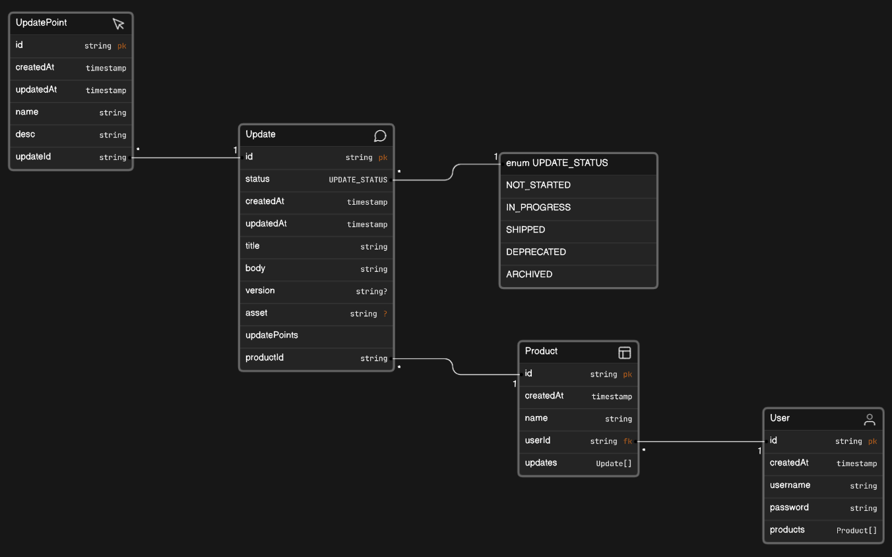

# updateslog
API to allow users to log updates to their products

# Problem Statement

# Solution Description

# Features
1. User can create/view/update a product
2. User can log update(s) to a product
3. User can view an(all) update(s) to a product
4. User can view all products
5. User can signin/signup

# Tech Stack
Database : PostgreSQL(Render)
Backend : Node.js, Express.js
Deployment : Render/Vercel

# Technical Designs
[Erasor.io Designs](https://app.eraser.io/workspace/2jr4Li835BN5QqEWHA7R)
[Figma Designs](https://www.figma.com/file/gdEYP2L0gyw6OZLAYGMZ8T/The-Magic-Pantry---ER-Diagram-(Community)?type=whiteboard&node-id=0-1&t=I0M1OpnRj7JS5Ade-0)
## DB Schema

## API Flow

# Setup
1. Clone the repository
2. Run `npm install` to install all the dependencies
3. Run `npm start` to start the server
4. Run `npm test` to run the tests

# API Documentation
The API documentation can be found [here](https://documenter.getpostman.com/view/10689707/Tz5tYz8n)

# References
1. API design v4 by Scott Moss

# Learnings
1. Build small features, test them and then build on top of these tested features.
2. More complex the feature, more time it takes to build and test. So divide it in chunks and build and test them separately.